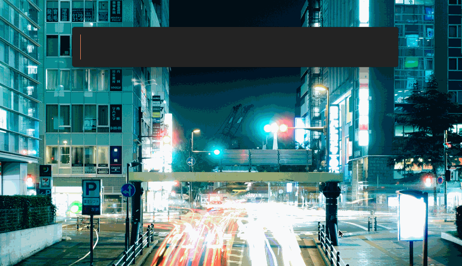

# dext-predawn-theme

> A theme for dext,



> Example uses [dext-giphy-plugin](https://github.com/adnasa/dext-giphy-plugin)

_Requires [dext](https://github.com/vutran/dext)_

## Installation

```
$ dpm install dext-predawn-theme
```

## Background

I <3 the [predawn theme](http://jamiewilson.io) and this is my homage to Jamie Wilson and his work.  
Thanks for this!
